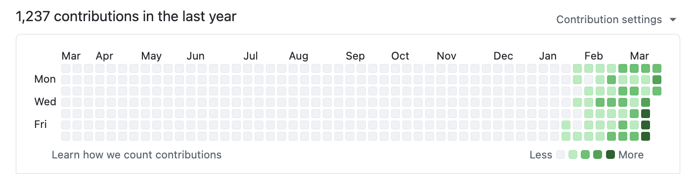
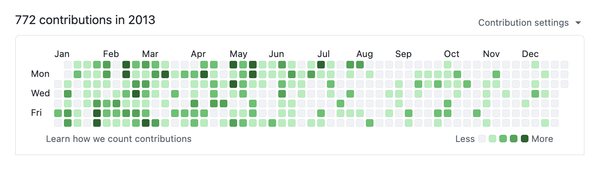

# gstack

> "Je ne pense pas avoir tapé une seule ligne de code depuis décembre, en gros, ce qui représente un changement extrêmement important." — [Andrej Karpathy](https://fortune.com/2026/03/21/andrej-karpathy-openai-cofounder-ai-agents-coding-state-of-psychosis-openclaw/), podcast No Priors, mars 2026

Quand j'ai entendu Karpathy dire ça, j'ai voulu comprendre comment. Comment une seule personne peut-elle livrer comme une équipe de vingt ? Peter Steinberger a construit [OpenClaw](https://github.com/openclaw/openclaw) — 247K étoiles GitHub — essentiellement seul avec des agents d'IA. La révolution est là. Un seul builder avec les bons outils peut aller plus vite qu'une équipe traditionnelle.

Je suis [Garry Tan](https://x.com/garrytan), Président & CEO de [Y Combinator](https://www.ycombinator.com/). J'ai travaillé avec des milliers de startups — Coinbase, Instacart, Rippling — quand elles n'étaient qu'une ou deux personnes dans un garage. Avant YC, j'étais l'un des premiers ingénieurs/PM/designers chez Palantir, j'ai cofondé Posterous (vendu à Twitter), et j'ai construit Bookface, le réseau social interne de YC.

**gstack est ma réponse.** Je construis des produits depuis vingt ans, et en ce moment je livre plus de produits que jamais. Au cours des 60 derniers jours : 3 services en production, plus de 40 fonctionnalités livrées, à temps partiel, tout en dirigeant YC à plein temps. En mesurant les changements logiques de code — pas les LOC (lignes de code) brutes, que l'IA gonfle — mon rythme de 2026 est **~810× celui de 2013** (11 417 vs 14 lignes logiques/jour). Depuis le début de l'année (jusqu'au 18 avril), 2026 a déjà produit **240× toute l'année 2013**. Mesuré sur 40 dépôts publics et privés `garrytan/*` incluant Bookface, après exclusion d'un dépôt de démonstration. L'IA a écrit la majeure partie. Le point n'est pas qui a tapé, mais ce qui a été livré.

> Les critiques des LOC n'ont pas tort de dire que les comptes de lignes brutes gonflent avec l'IA. Ils ont tort de penser qu'une fois normalisé pour l'inflation, je suis moins productif. Je suis plus productif, et de loin. Méthodologie complète, mises en garde et script de reproduction : **[On the LOC Controversy](docs/ON_THE_LOC_CONTROVERSY.md)**.

**2026 — 1 237 contributions, et le compteur tourne :**



**2013 — quand j'ai construit Bookface chez YC (772 contributions) :**



Même personne. Ère différente. La différence, ce sont les outils.

**gstack, c'est comme ça que je fais.** Il transforme Claude Code en une équipe d'ingénierie virtuelle — un CEO qui repense le produit, un responsable ingénierie qui verrouille l'architecture, un designer qui repère l'AI slop (bouillie d'IA), un reviewer qui trouve les bugs de production, un responsable QA (assurance qualité) qui ouvre un vrai navigateur, un responsable sécurité qui exécute des audits OWASP + STRIDE, et un ingénieur de livraison qui livre la PR (pull request). Vingt-trois spécialistes et huit outils avancés, le tout en commandes slash, tout en Markdown, tout gratuit, licence MIT.

C'est mon usine à logiciels open source. Je l'utilise tous les jours. Je la partage parce que ces outils devraient être accessibles à tous.

Forkez-la. Améliorez-la. Faites-en la vôtre. Et si vous voulez critiquer un logiciel open source gratuit — vous êtes les bienvenus, mais je préférerais que vous l'essayiez d'abord.

**À qui s'adresse ce projet :**
- **Fondateurs et CEO** — surtout les techniques qui veulent encore livrer
- **Nouveaux utilisateurs de Claude Code** — des rôles structurés au lieu d'un prompt vide
- **Tech leads et staff engineers** — review rigoureuse, QA et automatisation de livraison sur chaque PR

## Démarrage rapide

1. Installez gstack (30 secondes — voir ci-dessous)
2. Exécutez `/office-hours` — décrivez ce que vous construisez
3. Exécutez `/plan-ceo-review` sur toute idée de fonctionnalité
4. Exécutez `/review` sur toute branche avec des modifications
5. Exécutez `/qa` sur votre URL de staging (environnement de préproduction)
6. Arrêtez-vous là. Vous saurez si c'est fait pour vous.

## Installation — 30 secondes

**Prérequis :** [Claude Code](https://docs.anthropic.com/en/docs/claude-code), [Git](https://git-scm.com/), [Bun](https://bun.sh/) v1.0+, [Node.js](https://nodejs.org/) (Windows uniquement)

### Étape 1 : Installation sur votre machine

Ouvrez Claude Code et collez ceci. Claude s'occupe du reste.

> Installation de gstack : exécutez **`git clone --single-branch --depth 1 https://github.com/garrytan/gstack.git ~/.claude/skills/gstack && cd ~/.claude/skills/gstack && ./setup`** puis ajoutez une section "gstack" à CLAUDE.md indiquant d'utiliser le skill `/browse` de gstack pour toute navigation web, de ne jamais utiliser les outils `mcp__claude-in-chrome__*`, et listant les skills disponibles : /office-hours, /plan-ceo-review, /plan-eng-review, /plan-design-review, /design-consultation, /design-shotgun, /design-html, /review, /ship, /land-and-deploy, /canary, /benchmark, /browse, /connect-chrome, /qa, /qa-only, /design-review, /setup-browser-cookies, /setup-deploy, /setup-gbrain, /retro, /investigate, /document-release, /document-generate, /codex, /cso, /autoplan, /plan-devex-review, /devex-review, /careful, /freeze, /guard, /unfreeze, /gstack-upgrade, /learn. Demandez ensuite à l'utilisateur s'il souhaite également ajouter gstack au projet en cours pour que ses coéquipiers en bénéficient.

### Étape 2 : Mode équipe — mise à jour automatique pour les dépôts partagés (recommandé)

Depuis l'intérieur de votre dépôt, collez ceci. Cela vous bascule en mode équipe, initialise le dépôt pour que vos coéquipiers obtiennent gstack automatiquement, et commit le changement :

```bash
(cd ~/.claude/skills/gstack && ./setup --team) && ~/.claude/skills/gstack/bin/gstack-team-init required && git add .claude/ CLAUDE.md && git commit -m "require gstack for AI-assisted work"
```

Aucun fichier vendorisé dans votre dépôt, pas de dérive de version, pas de mises à jour manuelles. Chaque session Claude Code commence par une vérification rapide de mise à jour automatique (limitée à une fois par heure, résistante aux échecs réseau, totalement silencieuse).

Remplacez `required` par `optional` si vous préférez suggérer gstack à vos coéquipiers plutôt que de les bloquer.

### OpenClaw

OpenClaw lance des sessions Claude Code via ACP, donc tous les skills gstack fonctionnent simplement lorsque Claude Code a gstack installé. Collez ceci dans votre agent OpenClaw :

> Installation de gstack : exécutez `git clone --single-branch --depth 1 https://github.com/garrytan/gstack.git ~/.claude/skills/gstack && cd ~/.claude/skills/gstack && ./setup` pour installer gstack pour Claude Code. Ajoutez ensuite une section "Coding Tasks" à AGENTS.md indiquant : lors du lancement de sessions Claude Code pour du travail de codage, demandez à la session d'utiliser les skills gstack. Incluez ces exemples — audit de sécurité : "Load gstack. Run /cso", revue de code : "Load gstack. Run /review", test QA d'une URL : "Load gstack. Run /qa https://...", construction d'une fonctionnalité de bout en bout : "Load gstack. Run /autoplan, implement the plan, then run /ship", planification avant construction : "Load gstack. Run /office-hours then /autoplan. Save the plan, don't implement."

**Après l'installation, parlez simplement à votre agent OpenClaw naturellement :**

| Vous dites | Ce qui se passe |
|------------|-----------------|
| "Corrige la faute de frappe dans le README" | Simple — session Claude Code, gstack non nécessaire |
| "Effectue un audit de sécurité sur ce dépôt" | Lance une session Claude Code avec `Run /cso` |
| "Construis-moi une fonctionnalité de notifications" | Lance une session Claude Code avec /autoplan → implement → /ship |
| "Aide-moi à planifier la refonte de l'API v2" | Lance une session Claude Code avec /office-hours → /autoplan, sauvegarde le plan |

Consultez [docs/OPENCLAW.md](docs/OPENCLAW.md) pour le routage avancé des dispatch et les templates de prompts gstack-lite/gstack-full.

### Skills OpenClaw natifs (via ClawHub)

Quatre skills méthodologiques qui fonctionnent directement dans votre agent OpenClaw, sans session Claude Code nécessaire. Installez depuis ClawHub :

```
clawhub install gstack-openclaw-office-hours gstack-openclaw-ceo-review gstack-openclaw-investigate gstack-openclaw-retro
```

| Skill | Ce qu'il fait |
|-------|---------------|
| `gstack-openclaw-office-hours` | Interrogation produit avec 6 questions contraignantes |
| `gstack-openclaw-ceo-review` | Défi stratégique avec 4 modes de portée |
| `gstack-openclaw-investigate` | Méthodologie de débogage des causes racines |
| `gstack-openclaw-retro` | Rétrospective d'ingénierie hebdomadaire |

Ce sont des skills conversationnels. Votre agent OpenClaw les exécute directement via le chat.

### Autres agents d'IA

gstack fonctionne avec 10 agents de codage IA, pas seulement Claude. Le setup détecte automatiquement les agents que vous avez installés :

```bash
git clone --single-branch --depth 1 https://github.com/garrytan/gstack.git ~/gstack
cd ~/gstack && ./setup
```

Ou ciblez un agent spécifique avec `./setup --host <name>` :

| Agent | Flag | Installation des skills dans |
|-------|------|-----------------------------|
| OpenAI Codex CLI | `--host codex` | `~/.codex/skills/gstack-*/` |
| OpenCode | `--host opencode` | `~/.config/opencode/skills/gstack-*/` |
| Cursor | `--host cursor` | `~/.cursor/skills/gstack-*/` |
| Factory Droid | `--host factory` | `~/.factory/skills/gstack-*/` |
| Slate | `--host slate` | `~/.slate/skills/gstack-*/` |
| Kiro | `--host kiro` | `~/.kiro/skills/gstack-*/` |
| Hermes | `--host hermes` | `~/.hermes/skills/gstack-*/` |
| GBrain (mod) | `--host gbrain` | `~/.gbrain/skills/gstack-*/` |

**Vous voulez ajouter la prise en charge d'un autre agent ?** Consultez [docs/ADDING_A_HOST.md](docs/ADDING_A_HOST.md). Il suffit d'un fichier de configuration TypeScript, sans modification de code.

## Voyez-le en action

```
You:    I want to build a daily briefing app for my calendar.
You:    /office-hours
Claude: [asks about the pain — specific examples, not hypotheticals]

You:    Multiple Google calendars, events with stale info, wrong locations.
        Prep takes forever and the results aren't good enough...

Claude: I'm going to push back on the framing. You said "daily briefing
        app." But what you actually described is a personal chief of
        staff AI.
        [extracts 5 capabilities you didn't realize you were describing]
        [challenges 4 premises — you agree, disagree, or adjust]
        [generates 3 implementation approaches with effort estimates]
        RECOMMENDATION: Ship the narrowest wedge tomorrow, learn from
        real usage. The full vision is a 3-month project — start with
        the daily briefing that actually works.
        [writes design doc → feeds into downstream skills automatically]

You:    /plan-ceo-review
        [reads the design doc, challenges scope, runs 10-section review]

You:    /plan-eng-review
        [ASCII diagrams for data flow, state machines, error paths]
        [test matrix, failure modes, security concerns]

You:    Approve plan. Exit plan mode.
        [writes 2,400 lines across 11 files. ~8 minutes.]

You:    /review
        [AUTO-FIXED] 2 issues. [ASK] Race condition → you approve fix.

You:    /qa https://staging.myapp.com
        [opens real browser, clicks through flows, finds and fixes a bug]

You:    /ship
        Tests: 42 → 51 (+9 new). PR: github.com/you/app/pull/42
```

Vous avez dit "appli de briefing quotidien". L'agent a répondu "vous construisez un chef de cabinet en IA" — parce qu'il a écouté votre douleur, pas votre demande de fonctionnalité. Huit commandes, de bout en bout. Ce n'est pas un copilote. C'est une équipe.

## Le sprint

gstack est un processus, pas une collection d'outils. Les skills s'enchaînent dans l'ordre d'un sprint :

**Réfléchir → Planifier → Construire → Review → Tester → Livrer → Prendre du recul**

Chaque skill alimente le suivant. `/office-hours` rédige un document de conception que `/plan-ceo-review` lit. `/plan-eng-review` élabore un plan de test que `/qa` reprend. `/review` détecte des bugs que `/ship` vérifie corrigés. Rien ne passe à travers les mailles du filet, car chaque étape sait ce qui la précède.

| Skill | Votre spécialiste | Ce qu'ils font |
|------------|-------------------|----------------|
| `/office-hours` | **YC Office Hours** | Commencez ici. Six questions contraignantes qui recadrent votre produit avant d'écrire une ligne de code. Remettent en question votre cadre, challengent les prémisses, génèrent des alternatives d'implémentation. Le document de conception alimente tous les skills en aval. |
| `/plan-ceo-review` | **CEO / Fondateur** | Repensez le problème. Trouvez le produit 10 étoiles caché dans la demande. Quatre modes : Expansion, Expansion Sélective, Maintien du Périmètre, Réduction. |
| `/plan-eng-review` | **Responsable ingénierie** | Verrouillez l'architecture, le flux de données, les diagrammes, les cas limites et les tests. Force les hypothèses cachées à sortir au grand jour. |
| `/plan-design-review` | **Designer senior** | Note chaque dimension de design de 0 à 10, explique à quoi ressemble un 10, puis édite le plan pour y parvenir. Détection d'AI slop (bouillie d'IA). Interactif — une `AskUserQuestion` par choix de design. |
| `/plan-devex-review` | **Responsable Expérience Développeur** | Revue DX interactive : explore les personas développeurs, compare avec les TTHW des concurrents, conçoit votre moment magique, trace les points de friction étape par étape. Trois modes : DX EXPANSION, DX POLISH, DX TRIAGE. 20 à 45 questions contraignantes. |
| `/design-consultation` | **Partenaire Design** | Construit un système de design complet à partir de zéro. Étudie le paysage, propose des risques créatifs, génère des maquettes réalistes. |
| `/review` | **Staff Engineer** | Trouve les bugs qui passent la CI (intégration continue) mais explosent en production. Corrige automatiquement les évidences. Signale les lacunes de complétude. |
| `/investigate` | **Débogueur** | Débogage systématique des causes racines. Loi d'airain : pas de correctifs sans investigation. Trace le flux de données, teste les hypothèses, s'arrête après 3 correctifs échoués. |
| `/design-review` | **Designer qui code** | Même audit que `/plan-design-review`, puis corrige ce qu'il trouve. Commits atomiques, captures d'écran avant/après. |
| `/devex-review` | **Testeur DX** | Audit en direct de l'expérience développeur. Teste réellement votre onboarding : navigue dans la doc, essaie le flux de démarrage, chronomètre le TTHW, capture les erreurs. Compare avec les scores de `/plan-devex-review` — le boomerang qui montre si votre plan correspondait à la réalité. |
| `/design-shotgun` | **Explorateur Design** | "Montre-moi des options." Génère 4 à 6 variantes de maquettes IA, ouvre un tableau de comparaison dans votre navigateur, collecte vos retours et itère. La mémoire de goût apprend ce que vous aimez. Répétez jusqu'à ce que vous adoriez quelque chose, puis passez-le à `/design-html`. |
| `/design-html` | **Ingénieur Design** | Transforme une maquette en HTML de production qui fonctionne vraiment. Layout calculé par Pretext : le texte se réorganise, les hauteurs s'ajustent, les mises en page sont dynamiques. 30 Ko, zéro dépendance. Détecte React/Svelte/Vue. Routage API intelligent par type de design (landing page vs dashboard vs formulaire). Le résultat est livrable, pas une démo. |
| `/qa` | **Responsable QA** | Teste votre appli, trouve les bugs, les corrige avec des commits atomiques, revérifie. Génère automatiquement des tests de régression pour chaque correctif. |
| `/qa-only` | **Rapporteur QA** | Même méthodologie que `/qa` mais en rapport uniquement. Pur rapport de bugs sans modification de code. |
| `/pair-agent` | **Coordinateur Multi-Agents** | Partagez votre navigateur avec n'importe quel agent IA. Une commande, un copier-coller, connecté. Fonctionne avec OpenClaw, Hermes, Codex, Cursor, ou tout ce qui peut faire un `curl`. Chaque agent a son propre onglet. Lance automatiquement le mode headed pour que vous puissiez tout voir. Démarre automatiquement un tunnel ngrok pour les agents distants. Jetons scopés, isolation des onglets, limitation de débit, attribution d'activité. |
| `/cso` | **Responsable sécurité** | Modèle de menace OWASP Top 10 + STRIDE. Zéro bruit : 17 exclusions de faux positifs, seuil de confiance à 8/10+, vérification indépendante des découvertes. Chaque découverte inclut un scénario d'exploitation concret. |
| `/ship` | **Ingénieur de livraison** | Synchronise main, exécute les tests, audite la couverture, pousse, ouvre une PR. Amorce les frameworks de test si vous n'en avez pas. |
| `/land-and-deploy` | **Ingénieur de livraison** | Merge la PR, attend la CI et le déploiement, vérifie la santé de la production. Une commande de "approuvé" à "vérifié en production". |
| `/canary` | **SRE** | Boucle de monitoring post-déploiement. Surveille les erreurs console, les régressions de performance et les échecs de page. |
| `/benchmark` | **Ingénieur Performance** | Temps de chargement de base, Core Web Vitals et tailles des ressources. Compare avant/après sur chaque PR. |
| `/document-release` | **Rédacteur technique** | Met à jour toute la documentation du projet pour correspondre à ce que vous venez de livrer. Détecte automatiquement les README obsolètes. Construit une carte de couverture Diataxis (référence / how-to / tutoriel / explication) pour que les lacunes soient visibles dans le corps de la PR. |
| `/document-generate` | **Auteur de documentation** | Génère la documentation manquante à partir de zéro en utilisant le framework Diataxis. Étudie d'abord le codebase, puis rédige des docs référence / how-to / tutoriel / explication qui correspondent réellement au code. Invoquable en standalone ou enchaîné depuis `/document-release` lorsque la carte de couverture détecte des lacunes. En savoir plus : [tutoriel](docs/tutorial-document-generate.md) • [how-to](docs/howto-document-a-shipped-feature.md) • [pourquoi Diataxis](docs/explanation-diataxis-in-gstack.md). |
| `/retro` | **Responsable ingénierie** | Rétrospective hebdomadaire consciente de l'équipe. Décomptes par personne, séries de livraisons, tendances de santé des tests, opportunités de croissance. `/retro global` s'exécute sur tous vos projets et outils IA (Claude Code, Codex, Gemini). |
| `/browse` | **Ingénieur QA** | Donnez des yeux à l'agent. Navigateur Chromium réel, clics réels, captures d'écran réelles. ~100 ms par commande. `/open-gstack-browser` lance GStack Browser avec barre latérale, furtivité anti-bot et routage automatique de modèle. |
| `/setup-browser-cookies` | **Gestionnaire de session** | Importe les cookies de votre navigateur réel (Chrome, Arc, Brave, Edge) dans la session headless (sans interface graphique). Teste les pages authentifiées. |
| `/autoplan` | **Pipeline de revue** | Une commande, plan entièrement revu. Exécute automatiquement la revue CEO → design → ingénierie avec des principes de décision encodés. Ne surface que les décisions de goût pour votre approbation. |
| `/spec` | **Auteur de spécifications** | Transforme une intention vague en une spécification précise et exécutable en cinq phases (pourquoi, périmètre, technique avec lecture de code obligatoire, brouillon, fichier). Seuil de qualité Codex avant le fichier (bloque en dessous de 7/10), masquage des secrets en fail-closed, déduplication par rapport aux issues existantes, archivage dans `$GSTACK_STATE_ROOT/projects/$SLUG/specs/` pour le rappel du corpus d'équipe. `--execute` lance `claude -p` dans un worktree frais ; `/ship` ferme automatiquement l'issue source à la fusion. Conscient du mode plan. |
| `/learn` | **Mémoire** | Gérez ce que gstack a appris au fil des sessions. Passez en revue, recherchez, éliminez et exportez les patterns, pièges et préférences spécifiques au projet. Les apprentissages se cumulent d'une session à l'autre pour que gstack devienne plus intelligent sur votre codebase avec le temps. |
| `/make-pdf` | **Éditeur** | Markdown en entrée, document de qualité publication en sortie. Les blocs (fences) Mermaid/Excalidraw s'affichent sous forme de diagrammes vectoriels, entièrement hors ligne. Les images s'adaptent à la page et ne sont jamais tronquées ; les diagrammes larges ont leur propre page en paysage. `--to html` génère un fichier autonome, `--to docx` un document Word. |
| `/diagram` | **Créateur de diagrammes** | Anglais en entrée, diagramme modifiable en sortie. Émet un triplet : source Mermaid, `.excalidraw` que vous pouvez ouvrir et modifier sur excalidraw.com (style dessin à la main), et SVG/PNG rendu. Zéro réseau. Intégrez la source dans le markdown et `/make-pdf` le rendra. |

### Quelle review utiliser ?

| Conçu pour... | Phase de plan (avant le code) | Audit en direct (après livraison) |
|---------------|-------------------------------|-----------------------------------|
| **Utilisateurs finaux** (UI, web app, mobile) | `/plan-design-review` | `/design-review` |
| **Développeurs** (API, CLI, SDK, docs) | `/plan-devex-review` | `/devex-review` |
| **Architecture** (flux de données, perf, tests) | `/plan-eng-review` | `/review` |
| **Tout ce qui précède** | `/autoplan` (exécute CEO → design → eng → DX, détecte automatiquement ce qui s'applique) | — |

### Outils avancés

| Skill | Fonction |
|------------|----------|
| `/codex` | **Second avis** — review de code indépendante via OpenAI Codex CLI. Trois modes : review (seuil pass/fail), défi adversarial, et consultation ouverte. Analyse cross-model quand `/review` et `/codex` ont tous deux tourné. |
| `/careful` | **Garde-fous de sécurité** — alerte avant les commandes destructrices (`rm -rf`, `DROP TABLE`, force-push). Dites "be careful" pour activer. Contournement possible pour toute alerte. |
| `/freeze` | **Verrouillage d'édition** — restreint les modifications à un seul répertoire. Empêche les changements accidentels hors périmètre pendant le débogage. |
| `/guard` | **Sécurité totale** — `/careful` + `/freeze` en une seule commande. Sécurité maximale pour le travail en prod. |
| `/unfreeze` | **Déverrouillage** — supprime la limite `/freeze`. |
| `/open-gstack-browser` | **GStack Browser** — lance GStack Browser avec barre latérale, furtivité anti-bot, routage automatique des modèles (Sonnet pour les actions, Opus pour l'analyse), import de cookies en un clic, et intégration Claude Code. Nettoyez les pages, prenez des captures intelligentes, éditez le CSS, et renvoyez les infos à votre terminal. |
| `/setup-deploy` | **Configurateur de déploiement** — configuration unique pour `/land-and-deploy`. Détecte votre plateforme, l'URL de production, et les commandes de déploiement. |
| `/setup-gbrain` | **Intégration GBrain** — de zéro à gbrain opérationnel en moins de 5 minutes. PGLite local, URL Supabase existante, ou provisionnement automatique d'un nouveau projet Supabase via Management API. Enregistrement MCP pour Claude Code + triade de confiance par repo (lecture-écriture/lecture-seule/refus). [Guide complet](USING_GBRAIN_WITH_GSTACK.md). |
| `/sync-gbrain` | **Maintien du cerveau à jour** — réindexe le code de ce repo dans gbrain via `gbrain sources add` + `gbrain sync --strategy code`, rafraîchit le bloc `## GBrain Search Guidance` dans CLAUDE.md, et supprime automatiquement les conseils quand le check de capacité échoue. `--incremental` (par défaut), `--full`, `--dry-run`. Idempotent ; sûr à réexécuter. |
| `/gstack-upgrade` | **Mise à jour automatique** — met à jour gstack vers la dernière version. Détecte l'installation globale vs vendored, synchronise les deux, montre les changements. |
| `/ios-qa` | **QA iOS sur appareil réel (v1.43.0.0+)** — pilote un iPhone réel via USB CoreDevice grâce à un `StateServer` embarqué dans l'app. Lit le code Swift, génère des accesseurs typés `@Observable`, exécute la boucle d'agent. Le flag optionnel `--tailnet` expose l'appareil à OpenClaw ou tout agent HTTP sur votre tailnet Tailscale, permettant aux agents distants d'effectuer la QA iOS sans jamais toucher au matériel. Liste blanche des capacités (observer/interagir/modifier/restaurer), verrou de session par appareil, journal d'audit. |
| `/ios-fix`, `/ios-design-review`, `/ios-clean`, `/ios-sync` | Boucle de correction de bugs iOS, audit HIG par le designer, nettoyage du pont de débogage, et resynchronisation des accesseurs. Voir `docs/skills.md`. Procédure pas à pas : [docs/howto-ios-testing-with-gstack.md](docs/howto-ios-testing-with-gstack.md). |

### Nouveaux binaires (v0.19)

Au-delà des skills en slash-command, gstack livre des CLI autonomes pour les workflows qui n'ont pas leur place dans une session :

| Commande | Fonction |
|----------|----------|
| `gstack-model-benchmark` | **Benchmark cross-model** — exécute le même prompt sur Claude, GPT (via Codex CLI), et Gemini ; compare latence, tokens, coût, et (optionnellement) score de qualité LLM-judge. Auth détectée par fournisseur, les fournisseurs indisponibles sont sautés proprement. Sortie en tableau, JSON, ou markdown. `--dry-run` valide les flags + auth sans consommer d'appels API. |
| `gstack-taste-update` | **Apprentissage du goût design** — enregistre les approbations et rejets de `/design-shotgun` dans un profil de goût persistant par projet. Décroissance de 5%/semaine. Alimente les futures générations de variantes pour que le système apprenne ce que vous choisissez réellement. |
| `gstack-ios-qa-daemon` | **Démon QA iOS** — courtier côté Mac entre un agent et un iPhone connecté via USB CoreDevice. Boucle locale par défaut ; `--tailnet` ouvre un listener orienté Tailscale avec des niveaux de capacité contrôlés par identité. Instance unique via flock sur `~/.gstack/ios-qa-daemon.pid`. Voir [docs/howto-ios-testing-with-gstack.md](docs/howto-ios-testing-with-gstack.md). |
| `gstack-ios-qa-mint` | **Gestionnaire de liste blanche iOS** — CLI de grant par le propriétaire pour la liste blanche tailnet. `grant`/`revoke`/`list` contre `~/.gstack/ios-qa-allowlist.json` (mode 0600). Les agents distants ne sont jamais auto-ajoutés à la liste blanche ; ceci est le chemin à intention explicite. |

### Mode checkpoint continu (optionnel, local par défaut)

Définissez `gstack-config set checkpoint_mode continuous` et les skills enregistrent automatiquement votre travail au fur et à mesure avec un préfixe `WIP:` plus un corps structuré `[gstack-context]` (décisions, travail restant, approches échouées). Survit aux crashes et changements de contexte. `/context-restore` lit ces commits pour reconstruire l'état de la session. `/ship` filtre-squash les commits WIP avant la PR (préservant les commits non-WIP) pour que bisect reste propre. Le push est optionnel via `checkpoint_push=true` — par défaut local uniquement pour éviter de déclencher la CI à chaque commit WIP.

### Skills de domaine + échappatoire CDP brute

Deux nouvelles primitives de navigateur amplifient l'agent gstack au fil du temps :

- **`$B domain-skill save`** — l'agent enregistre une note par site (ex. : "Le bouton Apply de LinkedIn vit dans un iframe") qui se déclenche automatiquement la prochaine fois qu'il visite ce hostname. Quarantaine → actif après 3 utilisations réussies → promotion optionnelle cross-projet via `$B domain-skill promote-to-global`. Le stockage vit aux côtés du fichier d'apprentissages par projet de `/learn`. Référence complète : **[docs/domain-skills.md](docs/domain-skills.md)**.
- **`$B cdp <Domain.method>`** — échappatoire brute Chrome DevTools Protocol pour les rares cas où les commandes sélectionnées manquent. Refus par défaut : les méthodes doivent être explicitement ajoutées à `browse/src/cdp-allowlist.ts` avec une justification en une ligne. Mutex à deux niveaux pour sérialiser les appels CDP à portée navigateur contre le travail par onglet. La sortie des méthodes d'exfiltration de données est enveloppée dans l'enveloppe UNTRUSTED.

> Vous voulez du CDP brut sans garde-fous, sans liste blanche, sans démon — juste un transport fin de l'agent vers Chrome ? [browser-use/browser-harness-js](https://github.com/browser-use/browser-harness-js) relève d'une philosophie différente (helpers écrits par l'agent vs commandes sélectionnées de gstack) et est un bon choix si vous ne voulez pas de la stack de sécurité de gstack. Les deux peuvent coexister : `$B cdp` de gstack et le harness peuvent tous deux s'attacher au même Chrome via `newCDPSession` de Playwright.

**[Plongées profondes avec exemples et philosophie pour chaque skill →](docs/skills.md)**

### Les quatre modes d'échec de Karpathy ? Déjà couverts.

Les [règles d'AI coding d'Andrej Karpathy](https://github.com/forrestchang/andrej-karpathy-skills) (17K étoiles) identifient quatre modes d'échec : hypothèses erronées, complexité excessive, modifications orthogonales, impératif plutôt que déclaratif. Les skills de workflow de gstack les préviennent tous les quatre. `/office-hours` force les hypothèses à être exposées avant que le code ne soit écrit. Le Protocole de Confusion empêche Claude de deviner les décisions architecturales. `/review` détecte la complexité inutile et les modifications en passant. `/ship` transforme les tâches en objectifs vérifiables avec une exécution test-first. Si vous utilisez déjà les règles CLAUDE.md de style Karpathy, gstack est la couche d'application du workflow qui les fait respecter sur des sprints entiers, pas seulement sur des prompts individuels.

## Sprints parallèles

gstack fonctionne bien avec un seul sprint. Ça devient intéressant quand vous en avez dix qui tournent en même temps.

**Le design est au cœur du processus.** `/design-consultation` construit votre système de design à partir de zéro, recherche ce qui existe, propose des risques créatifs et rédige `DESIGN.md`. Mais la vraie magie réside dans le pipeline shotgun-to-HTML.

**`/design-shotgun` est votre outil d'exploration.** Vous décrivez ce que vous voulez. Il génère 4 à 6 variantes de maquettes avec GPT Image. Puis il ouvre un tableau de comparaison dans votre navigateur, avec toutes les variantes côte à côte. Vous choisissez vos préférées, laissez des retours ("plus d'espace blanc", "titre plus gras", "supprime le dégradé"), et il génère un nouveau tour. Répétez jusqu'à ce que vous aimiez le résultat. Après quelques tours, votre mémoire de goût entre en jeu et l'outil commence à privilégier ce qui vous plaît vraiment. Plus besoin de décrire votre vision avec des mots en espérant que l'IA comprenne. Vous voyez des options, sélectionnez les bonnes, et itérez visuellement.

**`/design-html` le rend réel.** Prenez cette maquette validée (issue de `/design-shotgun`, d'un plan CEO, d'une review de design ou simplement d'une description) et transformez-la en HTML/CSS de qualité production. Pas le genre d'HTML généré par IA qui semble correct à une seule largeur de viewport et casse partout ailleurs. Ici, on utilise Pretext pour un layout de texte calculé : le texte se réorganise vraiment au redimensionnement, les hauteurs s'adaptent au contenu, les layouts sont dynamiques. 30 Ko de surcharge, zéro dépendance. Il détecte votre framework (React, Svelte, Vue) et produit le bon format. Le routage intelligent de l'API sélectionne différents motifs Pretext selon qu'il s'agit d'une landing page, d'un dashboard, d'un formulaire ou d'un layout de carte. Le résultat est quelque chose que vous pourriez vraiment livrer, pas une démo.

**`/qa` a été une révélation.** Ça m'a permis de passer de 6 à 12 sessions en parallèle. Claude Code qui dit *"JE VOIS LE PROBLÈME"* et qui le corrige réellement, génère un test de régression et vérifie le correctif — ça a changé ma façon de travailler. L'agent a maintenant des yeux.

**Routage intelligent des reviews.** Comme dans une startup bien organisée : le CEO n'a pas besoin de regarder les corrections d'infra, la review de design n'est pas nécessaire pour les changements backend. gstack suit les reviews effectuées, détermine ce qui est approprié et fait simplement ce qu'il faut. Le Review Readiness Dashboard vous indique où vous en êtes avant de livrer.

**Testez tout.** `/ship` amorce des frameworks de test à partir de zéro si votre projet n'en a pas. Chaque exécution de `/ship` produit un audit de couverture. Chaque correction de bug via `/qa` génère un test de régression. 100 % de couverture de test est l'objectif — les tests rendent le vibe coding sûr au lieu d'être du yolo coding.

**`/document-release` est l'ingénieur que vous n'avez jamais eu.** Il lit tous les fichiers de documentation de votre projet, recoupe avec le diff et met à jour tout ce qui a dérivé. README, ARCHITECTURE, CONTRIBUTING, CLAUDE.md, TODOS — tout est maintenu à jour automatiquement. Et maintenant, `/ship` l'invoque automatiquement — la documentation reste à jour sans commande supplémentaire.

**Mode navigateur réel.** `/open-gstack-browser` lance GStack Browser, un Chromium contrôlé par IA avec un mode furtif anti-bot, un branding personnalisé et l'extension sidebar intégrée. Des sites comme Google et NYTimes fonctionnent sans captchas. La barre de menu affiche "GStack Browser" au lieu de "Chrome for Testing". Votre Chrome habituel reste intact. Toutes les commandes de navigation existantes fonctionnent sans changement. `$B disconnect` revient en mode headless. Le navigateur reste actif tant que la fenêtre est ouverte... pas de timeout d'inactivité qui le tue pendant que vous travaillez.

**Agent sidebar — votre assistant navigateur IA.** Tapez du langage naturel dans le panneau latéral de Chrome et une instance enfant de Claude l'exécute. "Va sur la page des paramètres et fais une capture d'écran." "Remplis ce formulaire avec des données de test." "Parcours chaque élément de cette liste et extrais les prix." La sidebar achemine automatiquement vers le bon modèle : Sonnet pour les actions rapides (clic, navigation, capture d'écran) et Opus pour la lecture et l'analyse. Chaque tâche dispose de jusqu'à 5 minutes. L'agent sidebar s'exécute dans une session isolée, donc il n'interfère pas avec votre fenêtre principale Claude Code. Importation des cookies en un clic directement depuis le footer de la sidebar.

**Automatisation personnelle.** L'agent sidebar n'est pas réservé aux workflows de développement. Exemple : "Parcours le portail parents de l'école de mon enfant et ajoute tous les noms, numéros de téléphone et photos des autres parents à mes Google Contacts." Deux façons de s'authentifier : (1) connectez-vous une fois dans le navigateur headed, votre session persiste, ou (2) cliquez sur le bouton "cookies" dans le footer de la sidebar pour importer les cookies depuis votre Chrome réel. Une fois authentifié, Claude navigue dans l'annuaire, extrait les données et crée les contacts.

**Défense contre l'injection de prompts.** Les pages web hostiles tentent de détourner votre agent sidebar. gstack intègre une défense multicouche : un classificateur ML de 22 Mo embarqué avec le navigateur analyse chaque page et sortie d'outil localement, un contrôle de transcript Claude Haiku vote sur la forme complète de la conversation, un token canari aléatoire dans le prompt système détecte les tentatives d'exfiltration de session à travers le texte, les arguments d'outils, les URLs et les écritures de fichiers, et un combineur de verdicts exige que deux classificateurs soient d'accord avant de bloquer (pour éviter les faux positifs d'un seul modèle sur les pages de type Stack Overflow). Une icône bouclier dans l'en-tête de la sidebar affiche le statut (vert/orange/rouge). Optez pour un ensemble DeBERTa-v3 de 721 Mo via `GSTACK_SECURITY_ENSEMBLE=deberta` pour un accord 2-sur-3. Interrupteur d'urgence : `GSTACK_SECURITY_OFF=1`. Voir [ARCHITECTURE.md](ARCHITECTURE.md#prompt-injection-defense-sidebar-agent) pour l'intégralité de la stack.

**Transfert au navigateur quand l'IA bloque.** Vous tombez sur un CAPTCHA, un mur d'authentification ou une invite MFA ? `$B handoff` ouvre un Chrome visible à la même page exacte avec tous vos cookies et onglets intacts. Résolvez le problème, dites à Claude que vous avez terminé, `$B resume` reprend là où il s'était arrêté. L'agent le suggère même automatiquement après 3 échecs consécutifs.

**`/pair-agent` est la coordination inter-agents.** Vous êtes dans Claude Code. Vous avez aussi OpenClaw qui tourne. Ou Hermes. Ou Codex. Vous voulez qu'ils regardent tous le même site web. Tapez `/pair-agent`, choisissez votre agent, et une fenêtre GStack Browser s'ouvre pour que vous puissiez observer. Le skill affiche un bloc d'instructions. Collez ce bloc dans le chat de l'autre agent. Il échange une clé de configuration unique contre un token de session, crée son propre onglet et commence à naviguer. Vous voyez les deux agents travailler dans le même navigateur, chacun dans son propre onglet, sans pouvoir interférer l'un avec l'autre. Si ngrok est installé, le tunnel démarre automatiquement pour que l'autre agent puisse être sur une machine complètement différente. Les agents sur la même machine bénéficient d'un raccourci sans friction qui écrit directement les identifiants. C'est la première fois que des agents IA de différents fournisseurs peuvent se coordonner via un navigateur partagé avec une véritable sécurité : tokens à portée limitée, isolation des onglets, limitation de débit, restrictions de domaine et attribution d'activité.

**Avis indépendant multi-IA.** `/codex` obtient une review indépendante de l'OpenAI Codex CLI — une IA complètement différente qui examine le même diff. Trois modes : review de code avec un seuil pass/fail, défi adversarial qui tente activement de casser votre code, et consultation ouverte avec continuité de session. Lorsque `/review` (Claude) et `/codex` (OpenAI) ont tous deux revu la même branche, vous obtenez une analyse croisée montrant quels résultats se recoupent et lesquels sont uniques à chaque modèle.

**Garde-fous de sécurité à la demande.** Dites "sois prudent" et `/careful` vous avertit avant toute commande destructive — `rm -rf`, `DROP TABLE`, force-push, `git reset --hard`. `/freeze` verrouille les modifications à un seul répertoire pendant le débogage pour que Claude ne puisse pas "corriger" accidentellement du code sans rapport. `/guard` active les deux. `/investigate` gèle automatiquement le module en cours d'investigation.

**Suggestions de skills proactives.** gstack remarque à quelle étape vous en êtes — brainstorming, review, débogage, test — et suggère le bon skill. Ça ne vous plaît pas ? Dites "arrête de suggérer" et il s'en souviendra d'une session à l'autre.

## 10-15 sprints en parallèle

gstack est puissant avec un seul sprint. Il devient transformateur quand dix sprints tournent en même temps.

[Conductor](https://conductor.build) exécute plusieurs sessions Claude Code en parallèle — chacune dans son propre espace de travail isolé. Une session lance `/office-hours` sur une nouvelle idée, une autre fait une `/review` sur une PR, une troisième implémente une fonctionnalité, une quatrième exécute `/qa` sur l'URL de staging, et six autres travaillent sur d'autres branches. Tout cela simultanément. Je lance régulièrement 10-15 sprints en parallèle — c'est le maximum pratique actuel.

La structure du sprint est ce qui rend le parallélisme efficace. Sans processus, dix agents ne sont que dix sources de chaos. Avec un processus — réfléchir, planifier, construire, review, tester, livrer — chaque agent sait exactement quoi faire et quand s'arrêter. Vous les gérez comme un CEO gère une équipe : vous vérifiez les décisions importantes, le reste tourne tout seul.

### Entrée vocale (AquaVoice, Whisper, etc.)

Les skills gstack ont des phrases déclencheuses adaptées à la voix. Exprimez naturellement ce que vous voulez —
"fais un contrôle de sécurité", "teste le site web", "fais une review technique" — et le bon skill s'active. Vous n'avez pas besoin de retenir les noms des commandes slash ou les acronymes.

## Désinstallation

### Option 1 : Exécuter le script de désinstallation

Si gstack est installé sur votre machine :

```bash
~/.claude/skills/gstack/bin/gstack-uninstall
```

Ce script gère les skills, les liens symboliques, l'état global (`~/.gstack/`), l'état local au projet, les daemons de navigation et les fichiers temporaires. Utilisez `--keep-state` pour conserver la configuration et les analytics. Utilisez `--force` pour sauter la confirmation.

### Option 2 : Suppression manuelle (sans dépôt local)

Si vous n'avez pas cloné le dépôt (par exemple, si vous avez installé gstack en collant l'instruction dans Claude Code puis supprimé le clone) :

```bash
# 1. Arrêter les daemons de navigation
pkill -f "gstack.*browse" 2>/dev/null || true

# 2. Supprimer les répertoires par skill dont le SKILL.md pointe vers gstack/
find ~/.claude/skills -mindepth 1 -maxdepth 1 -type d ! -name gstack 2>/dev/null |
while IFS= read -r dir; do
  link="$dir/SKILL.md"
  [ -L "$link" ] || continue
  target=$(readlink "$link" 2>/dev/null) || continue
  case "$target" in
    gstack/*|*/gstack/*)
      rm -f "$link"
      rmdir "$dir" 2>/dev/null || true
      ;;
  esac
done

# 3. Supprimer gstack
rm -rf ~/.claude/skills/gstack

# 4. Supprimer l'état global
rm -rf ~/.gstack

# 5. Supprimer les intégrations (ignorez celles que vous n'avez jamais installées)
rm -rf ~/.codex/skills/gstack* 2>/dev/null
rm -rf ~/.factory/skills/gstack* 2>/dev/null
rm -rf ~/.kiro/skills/gstack* 2>/dev/null
rm -rf ~/.openclaw/skills/gstack* 2>/dev/null

# 6. Supprimer les fichiers temporaires
rm -f /tmp/gstack-* 2>/dev/null

# 7. Nettoyage par projet (à exécuter depuis chaque racine de projet)
rm -rf .gstack .gstack-worktrees .claude/skills/gstack 2>/dev/null
rm -rf .agents/skills/gstack* .factory/skills/gstack* 2>/dev/null
```

### Nettoyer CLAUDE.md

Le script de désinstallation ne modifie pas CLAUDE.md. Dans chaque projet où gstack a été ajouté, supprimez les sections `## gstack` et `## Skill routing`.

### Playwright

`~/Library/Caches/ms-playwright/` (macOS) est laissé en place car d'autres outils peuvent l'utiliser. Supprimez-le si rien d'autre n'en a besoin.

---

Gratuit, sous licence MIT, open source. Pas de version premium, pas de liste d'attente.

J'ai open sourcé ma façon de construire du logiciel. Vous pouvez le forker et vous l'approprier.

> **Nous recrutons.** Vous voulez livrer de vrais produits à la vitesse du codage avec l'IA et aider à renforcer gstack ?
> Venez travailler chez YC — [ycombinator.com/software](https://ycombinator.com/software)
> Salaire et equity extrêmement compétitifs. San Francisco, quartier Dogpatch.

## GBrain — une mémoire persistante pour votre agent de codage

[GBrain](https://github.com/garrytan/gbrain) est une base de connaissances persistante pour les agents d'IA — imaginez-la comme la mémoire que votre agent conserve réellement entre les sessions. GStack vous offre un chemin en une seule commande pour passer de zéro à "c'est en marche, mon agent peut l'utiliser".

```bash
/setup-gbrain
```

Quatre options, choisissez-en une :

- **Supabase, URL existante** — votre agent cloud a déjà provisionné un cerveau ; collez l'URL du Session Pooler, et ce portable utilise les mêmes données.
- **Supabase, auto-provisionnement** — collez un Supabase Personal Access Token ; le skill crée un nouveau projet, l'interroge jusqu'à ce qu'il soit opérationnel, récupère l'URL du pooler et la transmet à `gbrain init`. Environ 90 secondes de bout en bout.
- **PGLite local** — zéro compte, zéro réseau, environ 30 secondes. Cerveau isolé sur ce Mac uniquement. Idéal pour un premier essai ; migrez vers Supabase plus tard avec `/setup-gbrain --switch`.
- **MCP gbrain distant** — votre cerveau s'exécute sur une autre machine (Tailscale, ngrok, LAN interne) ou sur le serveur d'un coéquipier ; collez une URL MCP et un bearer token. Optionnellement, associez-le à un PGLite local pour une recherche de code exploitant les symboles (symbol-aware) en mode split-engine. Parfait pour une mémoire multi-machines sans avoir à monter une base de données locale.

Après l'initialisation, le skill propose d'enregistrer gbrain en tant que serveur MCP pour Claude Code (`claude mcp add gbrain -- gbrain serve`) afin que `gbrain search`, `gbrain put`, etc. apparaissent comme des outils typés de première classe — et non comme des appels shell bash.

**Maintenir le cerveau à jour.** Exécutez `/sync-gbrain` depuis n'importe quel dépôt pour réindexer son code dans gbrain (incrémental par défaut, `--full` pour une réindexation complète, `--dry-run` pour prévisualiser). Le skill enregistre le répertoire courant comme source fédérée via `gbrain sources add`, exécute `gbrain sync --strategy code`, et écrit un bloc `## GBrain Search Guidance` dans le fichier CLAUDE.md de votre projet pour que l'agent privilégie `gbrain search`/`code-def`/`code-refs` plutôt que Grep. Le bloc est supprimé automatiquement si la vérification des capacités échoue — pas de conseils obsolètes pointant vers des outils non installés.

**Politique de confiance par dépôt distant.** Chaque dépôt sur votre machine se voit attribuer l'un de ces trois niveaux :

- `read-write` — l'agent peut rechercher dans le cerveau ET y écrire de nouvelles pages depuis ce dépôt
- `read-only` — l'agent peut rechercher mais n'écrit jamais (idéal pour les consultants multi-clients : recherchez dans le cerveau partagé, sans le contaminer avec le travail du Client A quand vous êtes dans le dépôt du Client B)
- `deny` — aucune interaction avec gbrain

Le skill vous demande une fois par dépôt. La décision est persistante entre les worktrees et les branches d'un même dépôt distant.

**Synchronisation de la mémoire GStack (fonctionnalité distincte, même infrastructure de dépôt privé).** Optionnellement, pousse l'état de votre gstack (apprentissages, plans du CEO, documents de conception, rétrospectives, profil du développeur) vers un dépôt git privé pour que votre mémoire vous suive sur toutes vos machines, avec une invite de confidentialité unique (tout autorisé / artefacts uniquement / désactivé) et un scanner de secrets en profondeur qui bloque les clés AWS, les tokens, les blocs PEM et les JWT avant qu'ils ne quittent votre machine.

```bash
gstack-brain-init
```

**Vous utilisez gstack dans Conductor ?** Conductor supprime explicitement `ANTHROPIC_API_KEY` et `OPENAI_API_KEY` de l'environnement de processus de chaque espace de travail, donc les évaluations payantes et les embeddings gbrain ne fonctionneront pas immédiatement. Définissez plutôt `GSTACK_ANTHROPIC_API_KEY` et `GSTACK_OPENAI_API_KEY` dans la configuration de l'environnement de l'espace de travail Conductor — les points d'entrée TS de gstack les promeuvent aux noms canoniques au runtime. Détails complets et checklist des contributeurs pour ajouter l'import aux nouveaux points d'entrée : [Conductor + GSTACK_* env vars](USING_GBRAIN_WITH_GSTACK.md#conductor--gstack_-env-vars).

**Tout y est — tous les scénarios, tous les flags, tous les helpers binaires, toutes les étapes de dépannage :** [USING_GBRAIN_WITH_GSTACK.md](USING_GBRAIN_WITH_GSTACK.md)

Autres références : [docs/gbrain-sync.md](docs/gbrain-sync.md) (guide spécifique à la synchronisation) • [docs/gbrain-sync-errors.md](docs/gbrain-sync-errors.md) (index des erreurs)

## Docs

| Doc | Contenu |
|-----|---------|
| [Skill Deep Dives](docs/skills.md) | Philosophie, exemples et workflow pour chaque skill (inclut l’intégration Greptile) |
| [Diagrams & Document Formats](docs/howto-diagrams-and-formats.md) | Blocs (fences) Mermaid/Excalidraw dans les PDF, tailles d’images et sécurités par défaut, `--to html\|docx`, triplets `/diagram` |
| [Builder Ethos](ETHOS.md) | Philosophie du *builder* : *Boil the Ocean*, *Search Before Building*, trois couches de connaissance |
| [Using GBrain with GStack](USING_GBRAIN_WITH_GSTACK.md) | Tous les chemins, flags, helpers binaires et étapes de dépannage pour `/setup-gbrain` |
| [GBrain Sync](docs/gbrain-sync.md) | Configuration de la mémoire multi-machines, modes de confidentialité, dépannage |
| [Architecture](ARCHITECTURE.md) | Décisions de conception et détails internes du système |
| [Browser Reference](BROWSER.md) | Référence complète des commandes pour `/browse` |
| [Contributing](CONTRIBUTING.md) | Configuration dev, tests, mode contributeur et mode dev |
| [Changelog](CHANGELOG.md) | Nouveautés à chaque version |

## Confidentialité et Télémétrie

gstack intègre une télémétrie d'utilisation **optionnelle** pour aider à améliorer le projet. Voici exactement ce qui se passe :

- **Désactivé par défaut.** Rien n'est envoyé où que ce soit tant que vous ne dites pas explicitement oui.
- **Au premier lancement**, gstack vous demande si vous souhaitez partager des données d'utilisation anonymes. Vous pouvez refuser.
- **Ce qui est envoyé (si vous acceptez)** : nom du skill, durée, succès/échec, version de gstack, OS. Point final.
- **Ce qui n'est jamais envoyé** : code, chemins de fichiers, noms de dépôts, noms de branches, prompts ou tout contenu généré par l'utilisateur.
- **Modifiable à tout moment** : `gstack-config set telemetry off` désactive tout instantanément.

Les données sont stockées dans [Supabase](https://supabase.com) (alternative open source à Firebase). Le schéma se trouve dans [`supabase/migrations/`](supabase/migrations/) — vous pouvez vérifier exactement ce qui est collecté. La clé « publishable » Supabase présente dans le dépôt est une clé publique (comme une clé API Firebase) — les politiques de sécurité au niveau des lignes refusent tout accès direct. La télémétrie transite par des fonctions edge validées qui appliquent des vérifications de schéma, des listes blanches de types d'événements et des limites de longueur de champs.

**Les analytics locales sont toujours disponibles.** Exécutez `gstack-analytics` pour consulter votre tableau de bord d'utilisation personnel à partir du fichier JSONL local — aucune donnée distante nécessaire.

## Dépannage

**Le skill n'apparaît pas ?** `cd ~/.claude/skills/gstack && ./setup`

**`/browse` échoue ?** `cd ~/.claude/skills/gstack && bun install && bun run build`

**Installation obsolète ?** Exécutez `/gstack-upgrade` — ou définissez `auto_upgrade: true` dans `~/.gstack/config.yaml`

**Vous préférez des commandes plus courtes ?** `cd ~/.claude/skills/gstack && ./setup --no-prefix` — passe de `/gstack-qa` à `/qa`. Votre choix est conservé pour les mises à niveau futures.

**Vous voulez des commandes avec espace de noms ?** `cd ~/.claude/skills/gstack && ./setup --prefix` — passe de `/qa` à `/gstack-qa`. Utile si vous utilisez d'autres packs de skills en parallèle de gstack.

**Codex indique "Skipped loading skill(s) due to invalid SKILL.md" ?** Vos descriptions de skills Codex sont obsolètes. Solution : `cd ~/.codex/skills/gstack && git pull && ./setup --host codex` — ou pour les installations locales au dépôt : `cd "$(readlink -f .agents/skills/gstack)" && git pull && ./setup --host codex`

**Utilisateurs Windows :** gstack fonctionne sur Windows 11 via Git Bash ou WSL. Node.js est requis en plus de Bun — Bun présente un bug connu avec le transport par pipe de Playwright sous Windows ([bun#4253](https://github.com/oven-sh/bun/issues/4253)). Le serveur de navigation bascule automatiquement sur Node.js. Assurez-vous que `bun` et `node` sont dans votre PATH.

Sur Windows sans Developer Mode (MSYS2 / Git Bash), `setup` utilise des copies de fichiers au lieu de liens symboliques car `ln -snf` produit des copies figées qui ne se mettent pas à jour lors d'un `git pull`. **Réexécutez `cd ~/.claude/skills/gstack && ./setup` après chaque `git pull`** pour que vos fichiers de skills correspondent au dépôt. `setup` affiche une note en une ligne pour vous le rappeler. Unix et WSL conservent les liens symboliques et n'ont pas besoin de cette réexécution.

**Claude dit qu'il ne voit pas les skills ?** Vérifiez que le `CLAUDE.md` de votre projet contient une section gstack. Ajoutez ceci :

```
## gstack
Use /browse from gstack for all web browsing. Never use mcp__claude-in-chrome__* tools.
Available skills: /office-hours, /plan-ceo-review, /plan-eng-review, /plan-design-review,
/design-consultation, /design-shotgun, /design-html, /review, /ship, /land-and-deploy,
/canary, /benchmark, /browse, /open-gstack-browser, /qa, /qa-only, /design-review,
/setup-browser-cookies, /setup-deploy, /setup-gbrain, /sync-gbrain, /retro, /investigate,
/document-release, /document-generate, /codex, /cso, /autoplan, /pair-agent, /careful, /freeze,
/guard, /unfreeze, /gstack-upgrade, /learn.
```

## Glossaire pour les novices

Quelques termes gardés en anglais dans ce document, expliqués pour les nouveaux venus :

- **Claude Code** — L'agent de codage d'Anthropic en ligne de commande.
- **OpenClaw** — Framework open source qui pilote des agents IA (247K étoiles GitHub).
- **vibe coding** — Coder au feeling en laissant l'IA écrire le code, en guidant par l'intention plutôt que ligne à ligne.
- **staging** — Environnement de préproduction, copie du site avant la mise en production.
- **headless** — Navigateur sans interface graphique, piloté par l'agent.
- **PR (pull request)** — Demande d'intégration de modifications de code dans un dépôt.
- **CI** — Intégration continue : exécution automatique des tests à chaque changement.
- **review** — Relecture critique du code avant fusion.
- **AI slop** — Bouillie d'IA : sortie générée par l'IA, verbeuse et de mauvaise qualité.

## Licence

MIT. Libre à jamais. Allez, construisez quelque chose.