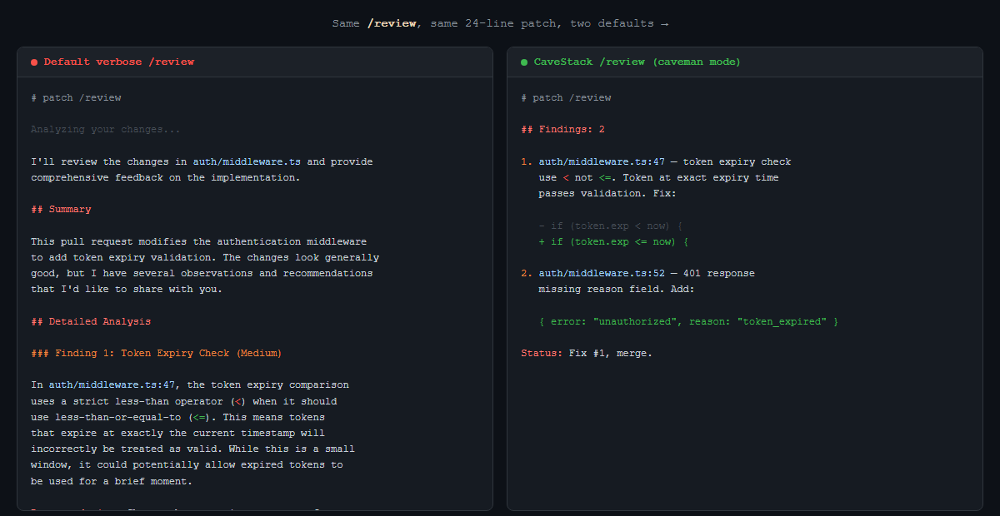

```
   ___                ___  _             _   
  / __\__ ___   _____/ __\| |_ __ _  ___| | __
 / /  / _` \ \ / / _ \__ \| __/ _` |/ __| |/ /
/ /__| (_| |\ V /  __/___) | || (_| | (__|   < 
\____/\__,_| \_/ \___|____/ \__\__,_|\___|_|\_\
```

> AI talk too much. CaveStack fix.



*Left: default verbose `/review`. Right: CaveStack `/review`, same patch. Same findings. ~250 words vs ~40.*

---

## What This

AI builder framework. Caveman mode = default. Every response: short, direct, no fluff. Same 40 skills. Same power. 75% fewer words.

Other AI tools: walls of text. Filler words. "I'd be happy to help you with that." Apologies for things that aren't wrong. Summaries of what you just said back to you.

CaveStack: answer. Done.

## Install (one line)

Need [Claude Code](https://docs.anthropic.com/en/docs/claude-code) + Git.
Bun auto-installs if missing (with SHA256-verified installer).

```bash
curl -fsSL https://cavestack.jerkyjesse.com/install | sh
```

Open new Claude Code session. Caveman mode active. No `/caveman` needed. Just works.

## Hero Six (featured in v1.0)

Six judgment-layer skills embody the "think before code" moat:

| Skill | What it does |
|-------|--------------|
| `/office-hours` | Premise challenge + design doc before building. Six forcing questions. |
| `/investigate` | Systematic root-cause debugging. Reproduce → isolate → diagnose → fix. |
| `/plan-eng-review` | Architecture + tests + coverage lock before implementation. |
| `/plan-design-review` | UI/UX audit with mockups before implementation. |
| `/plan-devex-review` | Developer experience critique with personas + benchmarks. |
| `/cso` | Security audit: OWASP Top 10, STRIDE, supply chain. |

**34 more skills** ship alongside — `/ship`, `/review`, `/qa`, `/checkpoint`, `/health`, `/retro`, `/browse`, `/autoplan`, `/codex`, and more. Invoke any by full name. Run `cavestack-skills list` in the terminal or `/help` inside Claude Code to see all 40.

## What You Get

| Thing | What It Do |
|-------|-----------|
| 40 skills | All installed, all invokable. Hero six featured, others by full name. |
| Caveman default | No command needed. First response = terse. Automatic. |
| Intensity dial | `/caveman lite` (gentle), `full` (default), `ultra` (maximum grunt) |
| Skill discovery | `cavestack-skills list` or `/help` — no website round-trip |
| Short aliases | `cs-*` for every `cavestack-*` CLI. Speed over typing. |
| Tier-2 errors | Every error: what broke + why + exact fix + docs link |
| Local DX metrics | `cavestack-dx show` — your TTHW and skill events, zero network |
| Productivity wrapper | `cavestack run <task>` with `--record` (redaction-gated share) |
| Windows-first | Bun compiles, Git Bash symlinks, PowerShell statusline. All work. |
| Reversible | `cavestack-uninstall`. Clean removal. Your files untouched. |
| Headless browser | `/browse` for QA, screenshots, page testing. Built in. |
| Design tools | `/design-consultation`, `/design-review`, `/design-shotgun` |
| Security audit | `/cso` — OWASP Top 10 + STRIDE threat modeling |
| Zero telemetry | No remote data ever. `/methodology` for how savings are measured. |
| Chars not tokens | Benchmark measures characters (model-agnostic). Same unit every terminal can count, no API key needed. |

## Try It Live

[See the interactive demo](https://jerkyjesse.github.io/cavestack/) — watch caveman mode compress verbose AI output in real-time.

## Before / After

| Verbose Claude | CaveStack Claude |
|---------------|-----------------|
| "I'd be happy to help you with that! Let me take a look at your code..." | *[reads code]* |
| "The issue appears to be related to the authentication middleware where the token expiry check is using a less-than operator instead of less-than-or-equal-to..." | "Bug in auth middleware. Token expiry check use `<` not `<=`. Fix:" |
| "Sure! I'll analyze the changes and provide a comprehensive review..." | *[reviews diff, reports findings]* |
| 47 lines explaining what it's about to do | 5 lines doing it |

## Why Fork, Not Plugin

Default behavior win. Every opt-in terse workaround — `/caveman` plugin, `be terse` in CLAUDE.md, hand-written prompts — require user to remember. They don't. Tool stay verbose. Senior eng close window, go back to grepping.

Only way change default = fork framework, ship terse as baseline.

Also: caveman need fire *before* first prompt. Need SessionStart hook owned by install. Fork own that. Plugin can't.

## Caveman Control

```bash
# During session:
stop caveman          # back to verbose (why though)
normal mode           # same thing
/caveman              # re-enable (default: full)
/caveman lite         # gentle compression
/caveman full         # classic caveman
/caveman ultra        # maximum grunt. fragments only.
```

```bash
# Permanent:
cavestack-settings-hook remove-caveman   # disable hooks entirely
cavestack-settings-hook install-caveman  # re-enable
```

## All Skills

```
/review          code review your diff
/ship            test, review, version, push, PR
/qa              QA test site + fix bugs
/investigate     systematic root-cause debugging
/office-hours    brainstorm ideas, startup diagnostic
/cso             security audit (OWASP + STRIDE)
/design-review   visual QA + fix loop
/browse          headless browser commands
/retro           weekly engineering retrospective
/codex           second opinion from OpenAI Codex
/plan-ceo-review     CEO-mode plan review
/plan-eng-review     architecture + test review
/plan-design-review  UI/UX design review
/autoplan        run all reviews in sequence
/checkpoint      save/resume work state
/health          code quality dashboard
...and 25 more. Full list: /caveman-help
```

## Trouble?

**Skill not show up?** `cd ~/.claude/skills/cavestack && ./setup`

**`/browse` fail?** `cd ~/.claude/skills/cavestack && bun install && bun run build`

**Stale install?** `/cavestack-upgrade` — or `auto_upgrade: true` in `~/.cavestack/config.yaml`.

**Caveman not fire on new session?** Check `~/.claude/settings.json` has `hooks.SessionStart` pointing at `caveman-activate.js` and `hooks.UserPromptSubmit` pointing at `caveman-mode-tracker.js`. Re-register: `cavestack-settings-hook install-caveman`. Need Node.js on PATH — hooks run under Node, not Bun.

**Windows?** Works on Windows 10/11 via Git Bash or WSL. Both `bun` and `node` on PATH. Bun has known Playwright pipe issue ([bun#4253](https://github.com/oven-sh/bun/issues/4253)), `browse` falls back to Node for server.

**`./setup` build error on Windows?** Known upstream glob issue in `browse/scripts/build-node-server.sh`. Main binaries still build. Non-blocking.

**Claude can't see skills?** Add cavestack section to project's `CLAUDE.md`. `/office-hours` does this automatically on first run.

**Bug?** [github.com/JerkyJesse/cavestack/issues](https://github.com/JerkyJesse/cavestack/issues) — include OS, `bun --version`, `node --version`, exact error.

## Uninstall

```bash
~/.claude/skills/cavestack/bin/cavestack-uninstall
```

Remove symlinks, hooks, state. Your files untouched.

## Credit

MIT. Caveman hooks: [Julius Brussee](https://github.com/JuliusBrussee/caveman). Built by [JerkyJesse](https://github.com/JerkyJesse). See [LICENSE](LICENSE).

---

<details>
<summary>Verbose README (for the wordy among us)</summary>

### What is CaveStack?

CaveStack is an AI builder framework that ships with "caveman mode" enabled by default. Caveman mode compresses AI responses by approximately 75% without losing technical accuracy. Instead of opting into terse responses, CaveStack makes them the default behavior from the very first prompt.

### Why does this exist?

Every AI coding tool ships with verbose output as the default. Users who prefer concise responses must remember to configure terse mode each session — adding `/caveman` commands, writing custom instructions in `CLAUDE.md`, or manually requesting brevity. Most don't bother. The tool stays verbose. Senior engineers close the window and go back to grepping.

CaveStack solves this by forking the upstream framework and making terse the baseline. Caveman mode fires on `SessionStart` before the first prompt is even processed, so there's nothing to remember and nothing to configure.

### Installation

CaveStack requires [Claude Code](https://docs.anthropic.com/en/docs/claude-code), [Bun](https://bun.sh/) v1.0+, [Node.js](https://nodejs.org/), and Git. To install:

```bash
git clone https://github.com/JerkyJesse/cavestack.git ~/.claude/skills/cavestack
cd ~/.claude/skills/cavestack && ./setup
```

After setup, open a new Claude Code session in any project directory. Caveman mode will be active automatically — no additional commands or configuration needed.

### Features

CaveStack includes all 40 skills from the CaveStack framework:

- **Code Review** (`/review`) — Analyze diffs for bugs, security issues, and style problems
- **Ship** (`/ship`) — Test, review, version bump, push, and create PR in one command
- **QA Testing** (`/qa`) — Systematically test web applications and fix bugs found
- **Investigation** (`/investigate`) — Structured root-cause debugging with four phases
- **Office Hours** (`/office-hours`) — Brainstorm ideas with startup diagnostic or builder mode
- **Security Audit** (`/cso`) — OWASP Top 10 and STRIDE threat modeling
- **Design Tools** (`/design-consultation`, `/design-review`, `/design-shotgun`) — Design system creation, visual QA, and variant exploration
- **Headless Browser** (`/browse`) — Navigate pages, take screenshots, test interactions
- **Retrospective** (`/retro`) — Weekly engineering retrospective with trend tracking
- **Plan Reviews** (`/plan-ceo-review`, `/plan-eng-review`, `/plan-design-review`) — Multi-perspective plan review pipeline
- **Deploy** (`/land-and-deploy`, `/canary`, `/benchmark`) — Merge, deploy, and monitor
- **And 25+ more** — Run `/caveman-help` for the full list

Additional CaveStack-specific features:

- **Always-on caveman mode** with three intensity levels: `lite` (gentle compression), `full` (classic caveman, the default), and `ultra` (maximum grunt, fragments only)
- **Windows-first installation** — Bun binaries compile, setup symlinks work under Git Bash, and the statusline is PowerShell-aware
- **Fully reversible** — `cavestack-uninstall` removes all symlinks, hooks, and state files without touching your project files
- **Caveman voice on all skill templates** — Not just the chat output, but the skill instructions themselves are compressed, reducing output size across the board. We measure in characters, not tokens, because tokens vary by model (GPT, Claude, Gemini all count differently). Characters are model-agnostic and every terminal can count them.

### Controlling Caveman Mode

During any session, you can adjust or disable caveman mode:

- `stop caveman` or `normal mode` — Return to standard verbose output
- `/caveman` — Re-enable caveman mode (defaults to `full`)
- `/caveman lite` — Gentle compression, mostly drops filler words
- `/caveman full` — Classic caveman: fragments, no articles, short synonyms
- `/caveman ultra` — Maximum compression, fragments only

To permanently disable caveman mode, run:
```bash
~/.claude/skills/cavestack/bin/cavestack-settings-hook remove-caveman
```

To re-enable it later:
```bash
~/.claude/skills/cavestack/bin/cavestack-settings-hook install-caveman
```

### Troubleshooting

| Problem | Solution |
|---------|----------|
| Skills not showing up | `cd ~/.claude/skills/cavestack && ./setup` |
| `/browse` fails | `cd ~/.claude/skills/cavestack && bun install && bun run build` |
| Stale install | Run `/cavestack-upgrade` or set `auto_upgrade: true` in `~/.cavestack/config.yaml` |
| Caveman not firing | Verify `~/.claude/settings.json` has `SessionStart` and `UserPromptSubmit` hooks pointing at `caveman-activate.js` and `caveman-mode-tracker.js`. Re-register with `cavestack-settings-hook install-caveman`. Ensure Node.js is on PATH. |
| Windows build error | Known upstream glob issue in `browse/scripts/build-node-server.sh`. Primary binaries still build successfully. Non-blocking for most workflows. |
| Claude can't see skills | Add a cavestack section to your project's `CLAUDE.md`. The `/office-hours` skill does this automatically on first run. |

### Reporting Bugs

Open an issue at [github.com/JerkyJesse/cavestack/issues](https://github.com/JerkyJesse/cavestack/issues) with your OS, `bun --version`, `node --version`, and the exact error output.

### License

MIT. See [LICENSE](LICENSE) for full attribution covering caveman (hooks) and CaveStack.

</details>
